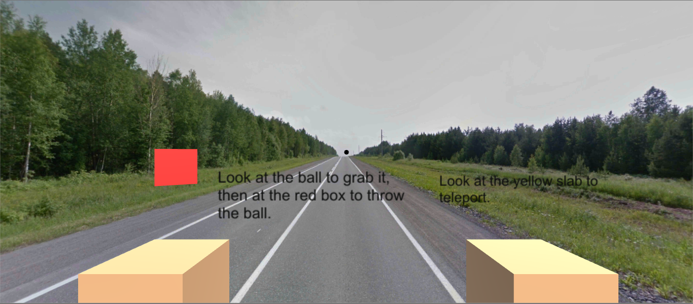

# Cardboard-Game
  
  This is a VR Game where you have to throw the ball to the red boxes with your point of view.
 
  
  
### Getting Started  
  
 * If you want to modify the game, after the changes, save It, build the game (File->Build Settings->Build) and continue with the next step.

 * Save Game.apk on your mobile phone and execute It using your phone.
 
### Prerequisites

* Android 4.4 'KitKat' (API Level 19) or more.

### Built With 

* [Unity](https://unity.com) - Game engine 
* [Street View](istreetview.com) - Where the 360 images were downloaded.

### Acknowledgment/Tutorial

* https://youtu.be/OEP7sMwfZnE?list=PLiuDBLn1FK-QOmpA3Vs2JY0DVAj0GfFPn

### Author

* [koncana](https://github.com/koncana)
